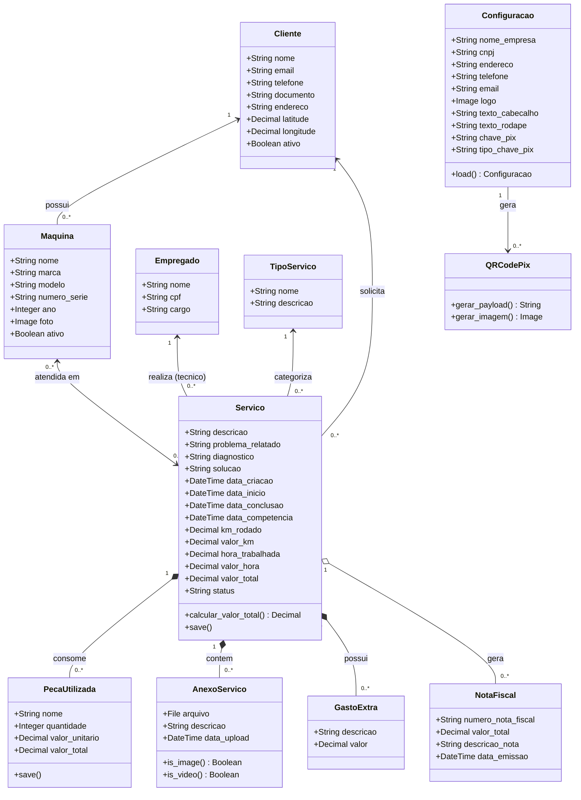

```mermaid

classDiagram
    direction TB

    class Cliente {
        +String nome
        +String email
        +String telefone
        +String documento
        +String endereco
        +Decimal latitude
        +Decimal longitude
        +Boolean ativo
    }

    class Maquina {
        +String nome
        +String marca
        +String modelo
        +String numero_serie
        +Integer ano
        +Image foto
        +Boolean ativo
    }

    class Empregado {
        +String nome
        +String cpf
        +String cargo
    }

    class TipoServico {
        +String nome
        +String descricao
    }

    class Servico {
        +String descricao
        +String problema_relatado
        +String diagnostico
        +String solucao
        +DateTime data_criacao
        +DateTime data_inicio
        +DateTime data_conclusao
        +DateTime data_competencia
        +Decimal km_rodado
        +Decimal valor_km
        +Decimal hora_trabalhada
        +Decimal valor_hora
        +Decimal valor_total
        +String status
        +calcular_valor_total() Decimal
        +save()
    }

    class PecaUtilizada {
        +String nome
        +Integer quantidade
        +Decimal valor_unitario
        +Decimal valor_total
        +save()
    }

    class AnexoServico {
        +File arquivo
        +String descricao
        +DateTime data_upload
        +is_image() Boolean
        +is_video() Boolean
    }

    class GastoExtra {
        +String descricao
        +Decimal valor
    }

    class NotaFiscal {
        +String numero_nota_fiscal
        +Decimal valor_total
        +String descricao_nota
        +DateTime data_emissao
    }

    class Configuracao {
        +String nome_empresa
        +String cnpj
        +String endereco
        +String telefone
        +String email
        +Image logo
        +String texto_cabecalho
        +String texto_rodape
        +String chave_pix
        +String tipo_chave_pix
        +load() Configuracao
    }

    class QRCodePix {
        +gerar_payload() String
        +gerar_imagem() Image
    }

    Cliente "1" <-- "0..*" Maquina : possui
    Cliente "1" <-- "0..*" Servico : solicita
    Empregado "1" <-- "0..*" Servico : realiza (tecnico)
    TipoServico "1" <-- "0..*" Servico : categoriza
    Maquina "0..*" <--> "0..*" Servico : atendida em
    Servico "1" *-- "0..*" PecaUtilizada : consome
    Servico "1" *-- "0..*" AnexoServico : contem
    Servico "1" *-- "0..*" GastoExtra : possui
    Servico "1" o-- "0..*" NotaFiscal : gera
    Configuracao "1" --> "0..*" QRCodePix : gera
```
