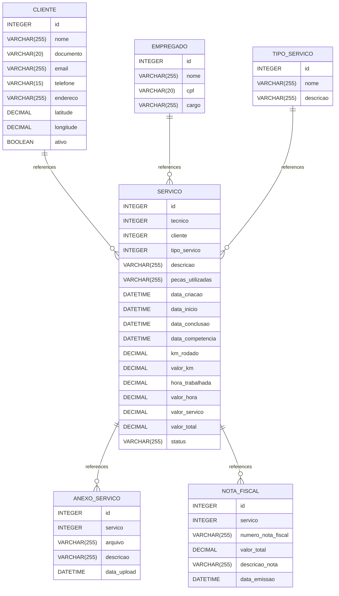

# modelagem documentation
## Summary

- [Introduction](#introduction)
- [Database Type](#database-type)
- [Table Structure](#table-structure)
	- [EMPREGADO](#empregado)
	- [TIPO_SERVICO](#tipo_servico)
	- [SERVICO](#servico)
	- [ANEXO_SERVICO](#anexo_servico)
	- [NOTA_FISCAL](#nota_fiscal)
	- [CLIENTE](#cliente)
- [Relationships](#relationships)
- [Database Diagram](#database-diagram)

## Introduction

## Database type

- **Database system:** MySQL
## Table structure

### EMPREGADO

| Name        | Type          | Settings                      | References                    | Note                           |
|-------------|---------------|-------------------------------|-------------------------------|--------------------------------|
| **id** | INTEGER | 🔑 PK, not null, autoincrement | fk_EMPREGADO_id_SERVICO | |
| **nome** | VARCHAR(255) | null |  | |
| **cpf** | VARCHAR(20) | null |  | |
| **cargo** | VARCHAR(255) | null |  | | 

### TIPO_SERVICO

| Name        | Type          | Settings                      | References                    | Note                           |
|-------------|---------------|-------------------------------|-------------------------------|--------------------------------|
| **id** | INTEGER | 🔑 PK, not null, autoincrement | fk_TIPO_SERVICO_id_SERVICO | |
| **nome** | VARCHAR(255) | null |  | |
| **descricao** | VARCHAR(255) | null |  | | 

### SERVICO

| Name        | Type          | Settings                      | References                    | Note                           |
|-------------|---------------|-------------------------------|-------------------------------|--------------------------------|
| **id** | INTEGER | 🔑 PK, not null, autoincrement | fk_SERVICO_id_ANEXO_SERVICO,fk_SERVICO_id_NOTA_FISCAL | |
| **tecnico** | INTEGER | null |  | |
| **cliente** | INTEGER | null |  | |
| **tipo_servico** | INTEGER | null |  | |
| **descricao** | VARCHAR(255) | null |  | |
| **pecas_utilizadas** | VARCHAR(255) | null |  | |
| **data_criacao** | DATETIME | null |  | |
| **data_inicio** | DATETIME | null |  | |
| **data_conclusao** | DATETIME | null |  | |
| **data_competencia** | DATETIME | null |  | |
| **km_rodado** | DECIMAL | null |  | |
| **valor_km** | DECIMAL | null |  | |
| **hora_trabalhada** | DECIMAL | null |  | |
| **valor_hora** | DECIMAL | null |  | |
| **valor_servico** | DECIMAL | null |  | |
| **valor_total** | DECIMAL | null |  | |
| **status** | VARCHAR(255) | null |  | | 

### ANEXO_SERVICO

| Name        | Type          | Settings                      | References                    | Note                           |
|-------------|---------------|-------------------------------|-------------------------------|--------------------------------|
| **id** | INTEGER | 🔑 PK, not null, autoincrement |  | |
| **servico** | INTEGER | null |  | |
| **arquivo** | VARCHAR(255) | null |  | |
| **descricao** | VARCHAR(255) | null |  | |
| **data_upload** | DATETIME | null |  | | 

### NOTA_FISCAL

| Name        | Type          | Settings                      | References                    | Note                           |
|-------------|---------------|-------------------------------|-------------------------------|--------------------------------|
| **id** | INTEGER | 🔑 PK, not null, autoincrement |  | |
| **servico** | INTEGER | null |  | |
| **numero_nota_fiscal** | VARCHAR(255) | null |  | |
| **valor_total** | DECIMAL | null |  | |
| **descricao_nota** | VARCHAR(255) | null |  | |
| **data_emissao** | DATETIME | null |  | | 

### CLIENTE

| Name        | Type          | Settings                      | References                    | Note                           |
|-------------|---------------|-------------------------------|-------------------------------|--------------------------------|
| **id** | INTEGER | 🔑 PK, not null, autoincrement | fk_CLIENTE_id_SERVICO | |
| **nome** | VARCHAR(255) | null |  | |
| **documento** | VARCHAR(20) | null |  | |
| **email** | VARCHAR(255) | null |  | |
| **telefone** | VARCHAR(15) | null |  | |
| **endereco** | VARCHAR(255) | null |  | |
| **latitude** | DECIMAL | null |  | |
| **longitude** | DECIMAL | null |  | |
| **ativo** | BOOLEAN | null |  | | 

## Relationships

- **CLIENTE to SERVICO**: one_to_many
- **EMPREGADO to SERVICO**: one_to_many
- **SERVICO to ANEXO_SERVICO**: one_to_many
- **SERVICO to NOTA_FISCAL**: one_to_many
- **TIPO_SERVICO to SERVICO**: one_to_many

## Database Diagram

